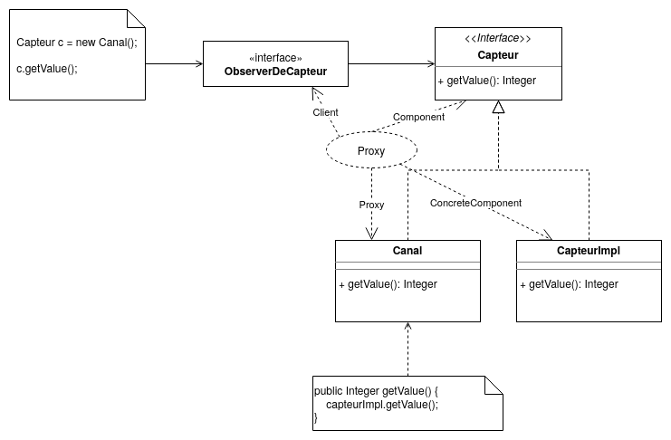
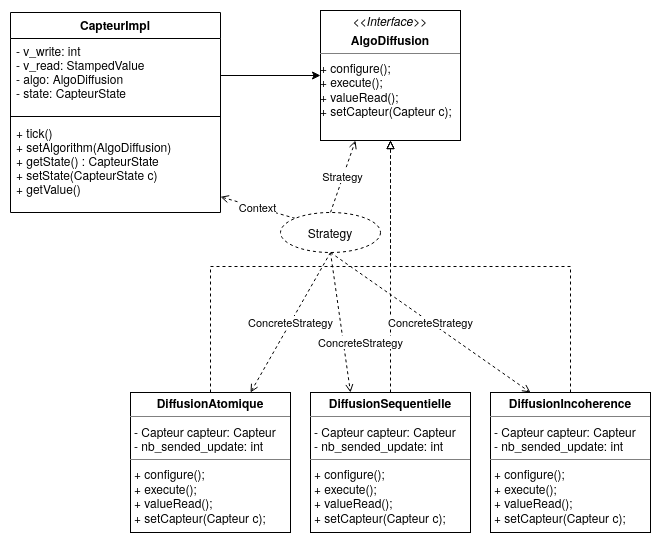
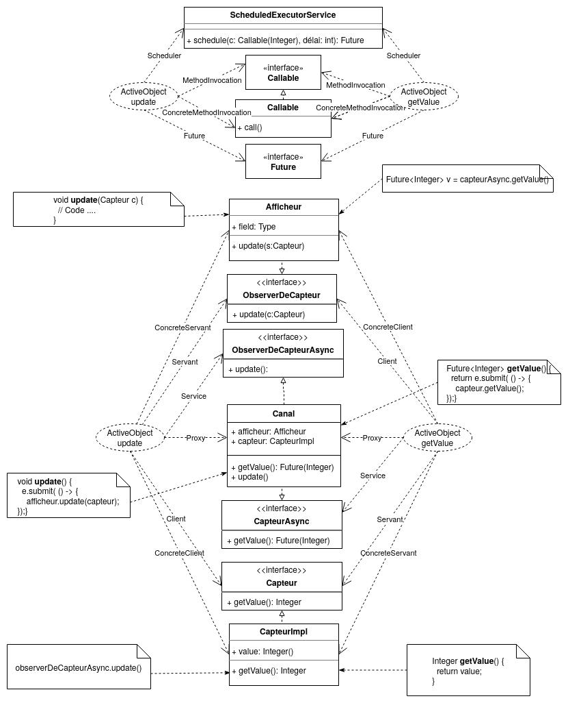
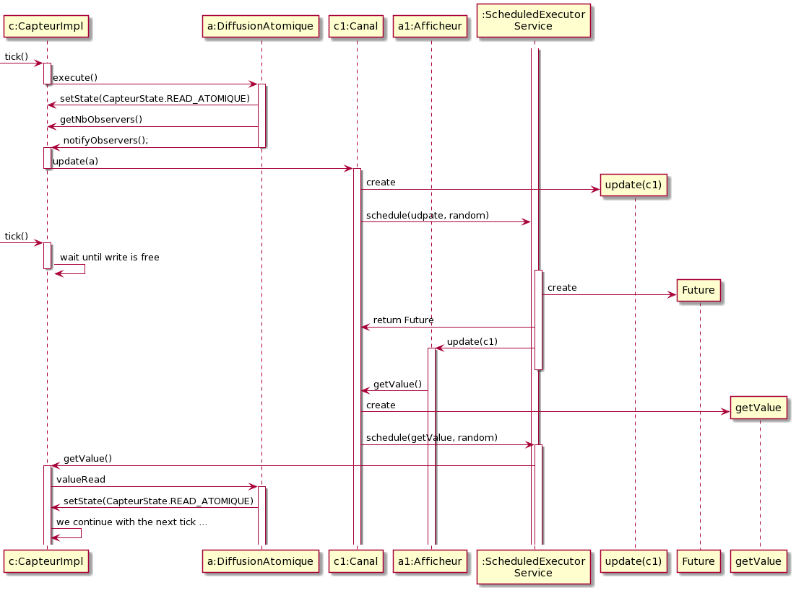
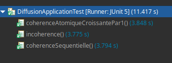

# Projet AOC

Gernez
Guzik

# Lancer les tests

Sur docker :
```
docker build -t observer .
docker run --name observer -t observer

// Pour supprimer le container
docker rm observer
// Ensuite supprimer l'image
docker rmi observer
```

Sur votre terminal :
```
mvn test
```

# Développement d'équipe

Nous avons travaillé la majorité du temps en utilisant Visual Studio Live Share ou en partage d'écran, les commits ne représentent donc pas forcément la répartition de la charge de travail.

# Organisation du code

Nous allons donner dans un premier temps un aperçu général du code. Nous avons :
- DiffusionApplication, qui initialise le capteur, les canaux, et les afficheurs.
- chaque Canal sera un observer de Capteur
- lors d'un tick, le capteur notifiera via un update tous ses observers, càd ces canaux. Les canaux enverront cette update vers leurs afficheurs en utilisant une lambda expression lancée depuis un ScheduledExecutorService avec un délai entre 0 et 100 millisecondes.
- une fois l'update reçue chez l'Afficheur, l'Afficheur lancera l'opération getValue() vers le Canal d'origine, le Canal lancera un getValue() en utilisant une lambda expression depuis un ScheduledExecutorService avec un délai entre 0 et 100 millisecondes.


# Patron de conception

Les premiers diagrammes que vous pouvez voir représentent comment nous avons pensé l'application dans un premier temps.  Certaines modification ont été faites, mais cela est expliqué dans le rapport.

## Patron Proxy

Nous avons commencé par regarder les patterns proxy :




Nous en avons conclu :


## Patron Observer

On implémente le patron Observer pour l'Afficheur, le sujet étant le Capteur.


## Patron Strategy

Le patron Stratégie est utilisé pour séparer les différents algorithmes de diffusion.



## Patron Active Object

À première vue, nous avions pensé à ça :



En essayant de programmer la fonction update, il fallait concilier ces deux bouts de code

```java
// Quand on se place côté update, on imagine ce code ..
class Afficheur {
  void update(Capteur c) {
      //...
  }
}

// Quand on se place côté getValue, on imagine ce code ..
class Afficheur {
// quelque part dans une fonction..
  Future<StampedValue> v = capteurAsync.getValue();
}

// On en conclut :
class Afficheur {
  void update(CapteurAsync c) {
      Future<StampedValue> v = capteurAsync.getValue();
  }
}

// La fonction update prend à présent un CapteurAsync, on rajoutera donc cette méthode à ObserverDeCapteur

// Égalemenent, il faudra aussi penser que l'implémentation de CapteurAsync sera un Canal et non le Capteur
// On en conclut donc que Canal fera update(this)
```

On en conclu donc cette image :


# Implémentation des algorithmes

## Introduction

Afin que chaque tick soit exécuté périodiquement, nous lançons nos ticks à l'aide de ScheduledExecutorService :

```java
for (int i = 0; i < ticks; i++) {
	sendTick();
}

private void sendTick() {
    scheduler.execute(() -> {
        capteur.tick();
    });
        Thread.sleep(75);
}
```

Ici, nous lancerons un tick toutes les 75 millisecondes.

Le compteur du Capteur aura 2 variables :
- v_write qui représente la variable d'écriture
- v_read qui sera la valeur renvoyé lors d'un getValue() 

Pour gérer l'accès à ces variables, le Capteur peut prendre plusieurs états :

```java
public enum CapteurState {
	WRITE, // v_write = v_read 
	READ_ATOMIQUE, // on ne peut pas écrire dans v_write tant que tous les observers n'ont pas lu la variable
	READ_SEQUENTIAL // on peut écrire dans v_write, mais on attend que tous les observers aient lu v_read avant de mettre à jour v_read
}
```

## Cohérence atomique

La cohérence atomique consiste à interdire l'écriture lors des phases de lecture.
Pour cela, on verrouille donc le capteur avant de notifier les observeurs, puis on compte chaque lecture, quand ils ont tous lu la valeur, on repasse en mode écriture. Si on essaie d'écrire depuis un thread, celui-ci attendra jusqu'au passage en mode écriture.

`CapteurImpl.java`
```java
public void tick() {
    boolean waiting = true;
    while (waiting) {
        lock.lock();
        if (state == CapteurState.WRITE) {
            v_write++;
            updateRead();
            waiting = false;
            algo.execute();
        }
        lock.unlock();
        if (state == CapteurState.READ_ATOMIQUE) {
            Thread.sleep(10);
        }
    }
}
```

`DiffusionAtomique.java`
```java
public void execute() {
    capteur.setState(CapteurState.READ_ATOMIQUE);
    nb_sended_update = capteur.getNbObservers();
    capteur.notifyObservers();
}

public void valueRead() {
    if (nb_sended_update == 0) {
        throw new Exception("valueRead(): tried to read in write phase");
    }
    nb_sended_update--;
    if (nb_sended_update == 0) {
        capteur.setState(CapteurState.WRITE);
    }
}
```


Plusieurs threads pouvaient se retrouver à écrire en même temps sur v_write, cela créait des race conditions, que nous avons réglées à l'aide d'un lock.

Pour éviter que des ticks se perdent, nous avons mis une boucle : 
```java
waiting = true;
while (waiting) {
        lock.lock();
        if (state == CapteurState.WRITE) {
            v_write++;
            updateRead();
            waiting = false;
            algo.execute();
        }
        lock.unlock();
        if (state == CapteurState.READ_ATOMIQUE) {
            Thread.sleep(10);
        }
    }
}
```

Si un appel de tick rentre dans cette boucle sans pouvoir écrire dans v_write, alors il attendra son tour jusqu'à pouvoir écrire.

Les tests confirment que cet algorithme fonctionne: les résultats sont tous affichés, et dans l'ordre. Évidemment, il y a des délais liés à l'attente des lecteurs (on obtient environ 8 secondes pour 50 ticks).

## Cohérence séquentielle

`CapteurImpl.java`
```java
public void tick() {
    if (state == CapteurState.READ_SEQUENTIAL) {
        v_write++;
    }
    lock.lock();
    if (state == CapteurState.WRITE) {
        v_write++; 
        updateRead();
        algo.execute();
    }
    lock.unlock();
}
```

`DiffusionSequentielle.java`
```java
public void execute() {
    capteur.setState(CapteurState.READ_SEQUENTIAL);
    nb_sent_updates = capteur.getNbObservers();
    capteur.notifyObservers();
}

public void valueRead() {
    if (nb_sent_updates == 0) {
        throw new Exception("valueRead(): tried to read in write phase");
    }
    nb_sent_updates--;
    if (nb_sent_updates == 0) {
        capteur.setState(CapteurState.WRITE);
    }
}
```

La cohérence séquentielle permet d'écrire même en phase de lecture, cependant la valeur lue reste la même et les observeurs ne sont pas notifiés de ces écritures qui sont donc perdues. Lorsque la phase de lecture se termine, la nouvelle valeur est disponible et la prochaine écriture se déroule normalement.

Lors des tests, on peut voir que les lecteurs manquent une partie des valeurs, mais les valeurs lues sont cohérentes (elles se suivent). Le programme s'exécute plus vite qu'en cohérence atomique, puisque les capteurs peuvent continuer à écrire pendant l'affichage (50 ticks prennent environ 6 secondes à s'exécuter). C'est bien le fonctionnement attendu.

## Incohérence

`CapteurImpl.java`
```java
public void tick() {
    lock.lock();
    v_write++;
    updateRead();
    algo.execute();
    lock.unlock();
}
public void updateRead() {
    v_read = new StampedValue(v_write);
    traces_read.add(v_write);
}
```

`DiffusionIncoherence.java`
```java
public void execute() {
    capteur.notifyObservers();
}
```

`Afficheur.java`
```java
public void update(CapteurAsync canal) {
    Future<StampedValue> f = canal.getValue();
    StampedValue v = null;
    v = f.get();
    long timestamp = v.getTimestamp();
    if (timestamp > last_timestamp) {
        last_timestamp = timestamp;
        Logger.getGlobal().info(String.valueOf(v.getValue()));
    } else {
        Logger.getGlobal().info("INCOHERENCE");
    }
}

```

Pour l'incohérence nous avons implémenté une classe StampedValue, qui contient la valeur (int) et une estampille temporelle (long) obtenue lors de l'écriture. On vérifie dans un afficheur que les valeurs obtenues se suivent bien dans le temps, et on ignore les valeurs plus vieilles que celles précédemment lues.

Pour les tests, on affiche `INCOHERENCE` dans la console lorsqu'une valeur ancienne est lue après une valeur nouvelle. Les résultats montrent un certain nombre d'incohérences, mais vu qu'on les ignore, ce n'est pas un problème. Le temps d'exécution est semblable à celui en cohérence séquentielle (environ 6 secondes pour 50 ticks). En conclusion, cette implémentation semble correspondre aux attentes.

# Implémentation d'Active Object

Maintenant que nous avons vu comment les algorithmes étaient implémentés, nous allons voir la mécanique d'ActiveObject.
Les code ci dessous à été simplifié pour améliorer la compréhension

```java

// 1 - Initialisation des composants :

public class DiffusionApplication {

	public void initialize(AlgoDiffusion algo, int nb_afficheur) {
		capteur.setAlgorithm(algo);

		scheduler = Executors.newScheduledThreadPool(nb_afficheur * 10);

		for (int i = 0; i < nb_afficheur; i++) {
			afficheurs.add(new Afficheur());
		}

		for (int i = 0; i < nb_afficheur; i++) {
			Canal c = new Canal(capteur, afficheurs.get(i), scheduler);
			canals.add(c);
			capteur.attach((Observer) c);
		}
	}

// 2 - On tick
	public void run(int ticks) {
		if (ticks >= 0) {
			for (int i = 0; i < ticks; i++) {
				sendTick();
			}
		} else {
			while (true) {
				sendTick();
			}
		}
	}

	private void sendTick() {
		scheduler.execute(() -> {
			capteur.tick();
		});
		try {
			Thread.sleep(75);
		} catch (InterruptedException e) {
			e.printStackTrace();
		}
	}

	public static void main(String[] args) {
		DiffusionApplication app = new DiffusionApplication();
		app.initialize(new DiffusionSequentielle(), 4);
		app.run(50);
        app.scheduler.shutdown();
	}
}

// 3 - Réception du tick :

public class CapteurImpl extends AbstractSubject implements Capteur {
	public void tick() {
        // Voir partie supérieure
        algo.execute();
	}
}

// 4 - Quelque soit la diffusion
public class DiffusionAtomique implements AlgoDiffusion {

	int nb_sended_update = 0;

    // 5 - On notifie tous les observers
	public void execute() {
		// .. code de execute ..
		nb_sended_update = capteur.getNbObservers();
		capteur.notifyObservers();
	}

    // 10 (FIN) - On indique qu'on a reçu le getValue() et si besoin on rechange l'état du capteur
	public void valueRead() {
		nb_sended_update--;
		if (nb_sended_update == 0) {
			capteur.setState(CapteurState.WRITE);
		}
	}
}

// 6 - Les observers sont les canaux

public class Canal extends AbstractSubject implements CapteurAsync, ObserverDeCapteurAsync {

	public Canal(Capteur capteur, ObserverDeCapteur afficheur, ScheduledExecutorService scheduler) {
		this.capteur = capteur;
		this.afficheur = afficheur;
		this.scheduler = scheduler;
	}

    // 7 - On envoie l'update à l'afficheur avec un délai
	public void update(Capteur subject) {
		scheduler.schedule(() -> {
			afficheur.update(this);
		}, ThreadLocalRandom.current().nextInt(0, 100), TimeUnit.MILLISECONDS);
	}

    // 9 - Le getValue de l'Afficheur est transmis au capteur
	public Future<StampedValue> getValue() {
		return scheduler.schedule(() -> {
			return capteur.getValue();
		}, ThreadLocalRandom.current().nextInt(0, 100), TimeUnit.MILLISECONDS);
	}
}

public class Afficheur implements ObserverDeCapteur {

    // 8 - L'afficheur fait un getValue() et attend son retour
	public void update(CapteurAsync canal) {
		Future<StampedValue> f = canal.getValue();
		StampedValue v = f.get();
		Logger.getGlobal().info(v);
	}
}

```

Diagramme de séquence d'ActiveObject avec DiffusionAtomique



# Résultat des tests

Nous avons écrit différents tests JUnit.
Ils sont basés sur le fait que la valeur du capteur commence à 0 et est incrémentée à chaque tick.

- `coherenceAtomiqueCroissantePar1` : en cohérence atomique, pour chaque afficheur, la valeur lue doit être égale à la précédente augmentée de 1. Autrement dit, les afficheurs reçoivent toutes les valeurs.

- `coherenceSequentielle` : on vérifie qu'en utilisant l'algorithme de cohérence séquencielle, à chaque tick, tous les afficheurs reçoivent la même valeur

- `incoherence` : avec l'algorithme d'incohérence assistée, on vérifie que les valeurs obtenues sont croissantes.

De plus, dans chaque test, on s'assure que la dernière valeur lue n'est pas supérieure au nombre de ticks.

Tous les tests sont passés avec succès. 




