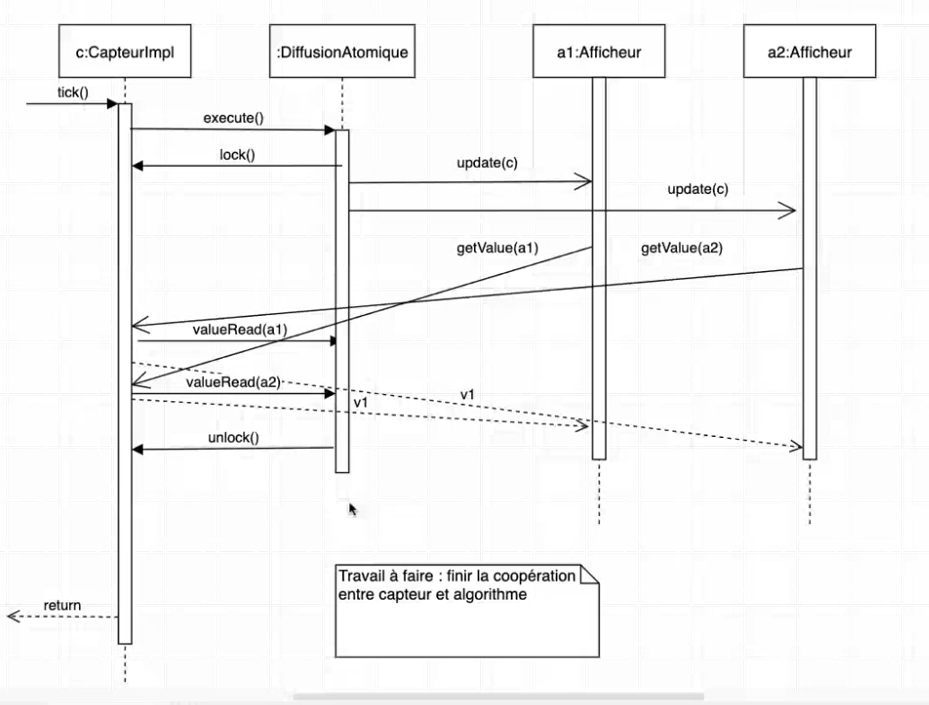

Thomas Guzik
Lisa Gernez

# Algo de diffusion

## Trois modèles de cohérence

Problème des lecteurs rédacteurs...
Ici on a pour Subject une variable qui est l'attribut valeur du sujet, 1 rédacteur (le mutateur), et N lecteurs (les observers). Il y a 3 idées pour la mise en oeuvre:
- cohérence atomique, cohérence séquentielle, incohérence assistée

Mais d'abord, définissons les cohérences dans ce cadre :
- Soit V la suite des valeurs écrites dans la variable V = V_1, V_2,...,V_x produites par le mutateur (= rédacteur).
- Soit L(i) la suite des valeurs lues par chaque observer O_i : `L(i) = L(i)_1,...``

*fin td1 2020-10-13*

## Cohérence atomique

#### Définition de atomique

Pour tout i : L(i) = V

Toutes les valeurs écrites sont des valeurs lues. La suite de valeurs écrites V est la même que la suite de valeur lues L(i)

#### Réalisation (comment faire)

Les appels ne se perdent pas, ils sont executés une fois.

Alternance rédacteurs/lecteurs :

1. Initialement le rédacteur peut écrire dans la variable (= le mutateur peut modifier le sujet,
un appel à setValue(v_i))

2. À la fin de l'écriture, la phase de lecture commence.

3. Pendant la phase de lecture, toute écriture est interdite.

4. Lorsque tous les lecteurs ont lu une fois (par appel à getValue()) la phase de lecture termine et la phase d'écriture
commence.

### Cohérence séquentielle

#### Définition de séquentielle

1. Pour tout i : L(i) est une sous-suite de V
-> Ce qui signifie que certaines valeurs écrites par le redacteur ne sont pas connu par les observers

2. Pour tout i : L(i) = L ; une seule sous-suite autorisée => tous les lecteurs (Observers) voient la même chose

Avantage par rapport à la cohérence atomique : on ne bloque pas le mutateur (pas d'exclusion mutuelle entre
lecteurs et rédacteur).

Inconvénient : on perd des valeurs produites par le rédacteur.

Dans certains nombre de cas, on a besoin que le rédacteur écrite les valeurs produites le + rapidement possible même si on perd des données (par ex. thermomètre)

#### Réalisation

1. Les lecteurs lisent une copie de la variable.

2. Le mutateur écrit dans l'original, sans exclusion mutuelle.

3. Au début d'une phase de lecture, on copie l'original dans la variable copie et les getValue() retourne la valeur de la copie.

4. Lorsque tout les lecteurs ont lu une fois, la phase de lecture est finie : pendant la phase de lecture la copie est "gelée".

En d'autres termes : une variable pour le rédacteur, une autre pour les lecteurs ; cohérence atomique de la copie

### Incohérence (assistée)

#### Définition de causale

1. Pour tout i : L(i) est une sous-suite de V

Par contre pas de règle pour dire que les L(i) doit être unique

#### Implémentation de causale

1. On utilise un mécanisme d'horloge (estampille). (utilisation d'un temps logique, de tampon : au temps(i), la variable vaut ...)

1. Au moment de l'écriture de la valeur V_i, la valeur est estampillée avec i.

2. Lors d'une lecture, un lecteur reçoit la valeur courante de la variable, avec son estampille.

3. Si la valeur reçue est plus ancienne que celle précédemment reçue(par ex. on fait 2 getValue()), on ne garde que la plus récente (au sens des estampille, = celle qui a l'estampille la plus élevée).

# Info TP

", les données diffusées seront une séquence croissante d’entiers" -> on peut faire de la cohérence atomique, car on peut prévoir les valeurs. Egalement v(i) = i

"les canaux" -> permettent de mettre un délai.

" un ensemble de canaux de transmission avec des délais variables" -> au moins 4 canaux 

" un ensemble d’afficheurs réalisés en utilisant la bibliothèque graphi-
que Swing ; " -> pas besoin, par contre enregistré ça dans des listes pour qu'on puisse faire des tests et qu'oracle puisse dire que les affichers se comportent bien comme des lecteurs dans le modèle de cohérence atomique/ séquentielle/ incohérence.

" un ensemble de politiques de diffusion Observer," -> gestion de la cohérence

pattern strategy est utilisé pour gérer les 3 pattern de diffusion

le canal joue le role de proxy

# Diagramme de conception

# M1

Il manque des update vers diffusion atomique

# M2

# M3

