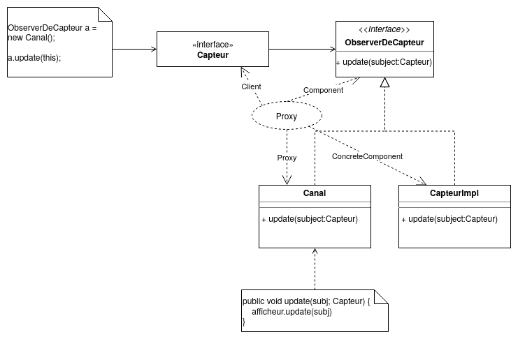
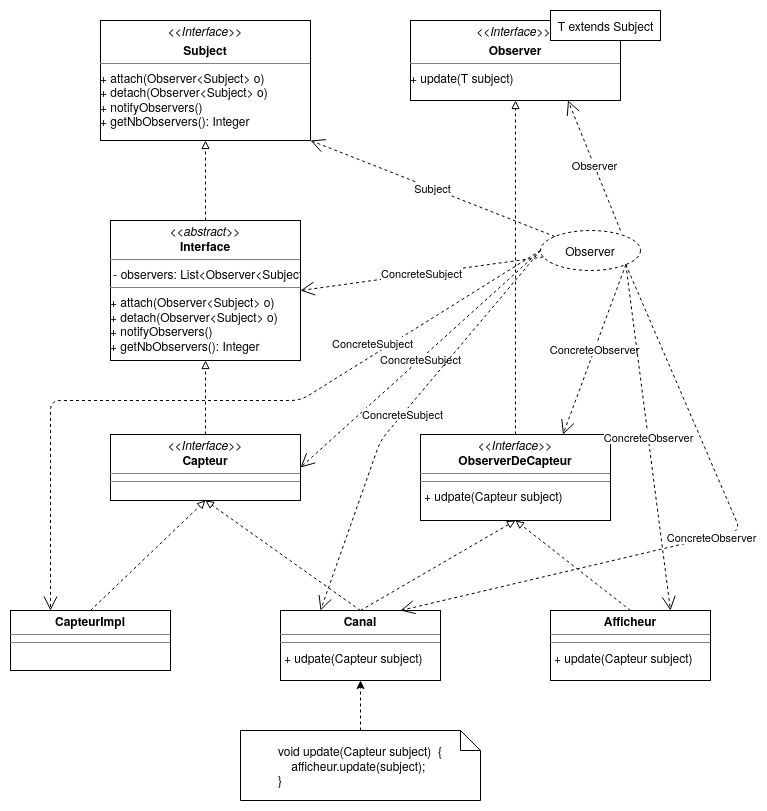

# Projet AOC

Gernez
Guzik

# Lancer les tests

Sur docker :
```
docker build -t observer .
docker run --name observer -t observer

// Pour supprimer le container
docker rm observer
// Ensuite supprimer l'image
docker rmi observer
```

Sur votre terminal :
```
mvn test
```

# Patron de conception

Les premiers diagrammes que vous pouvez voir représentent comment nous avons pensé l'application dans un premier temps.  Certaines modification ont été faîtes, mais cela est expliqué dans le rapport.

## Patron Proxy

Nous avons commencé par regarder les patterns proxy :




Nous en avons conclu :


## Patron Observer

On implémente le patron Observer pour l'Afficheur, le sujet étant le Capteur.



## Patron Strategie

Le patron Stratégie est utilisé pour séparer les différents algorithmes de diffusion.

## Patron Active Object

À première vue, nous avons pensé à ça :

Par la suite, nous avons décidé d'utiliser cette architecture :

# Implémentation des algorithmes

## Introduction

## Cohérence atomique

// Copier un peu le code

La cohérence atomique consiste à interdire l'écriture lors des phases de lecture.
Pour cela, on verouille donc le capteur avant de notifier les observeurs, puis on compte chaque lecture, quand ils ont tous lu la valeur, on repasse en mode écriture. Si on essaie d'écrire depuis un thread, celui-ci attendra jusqu'au passage en mode écriture.

De plus, comme plusieurs threads pouvaient se retrouver à écrire, cela créait des race conditions, que nous avons réglées à l'aide d'un lock.

## Cohérence séquentielle

La cohérence séquentielle permet d'écrire même en phase de lecture, cependant les observeurs ne sont pas notifiés de ces écritures qui sont donc perdues. Lorsque la phase de lecture se termine, la nouvelle valeur est disponible et la prochaine écriture se déroule normalement.

## Incohérence

Pour l'incohérence nous avons implémenté une classe StampedValue, qui contient la valeur (int) et une estampille temporelle (long) obtenue au moment de l'écriture.

On vérifie dans afficheur que les valeurs obtenues se suivent bien dans le temps, et on ignore les valeurs plus vieilles que celle précédemment lue.

# Résultat des tests

Pour la cohérence atomique, le test consiste ...


